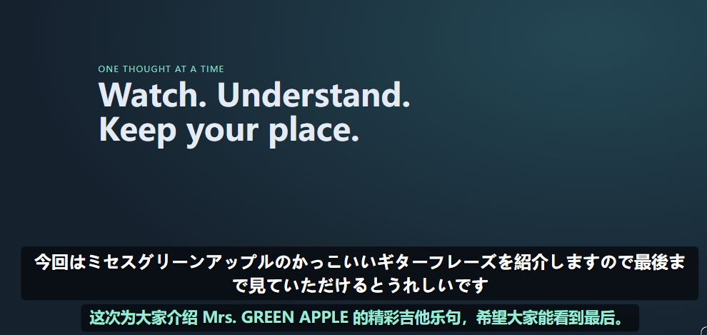
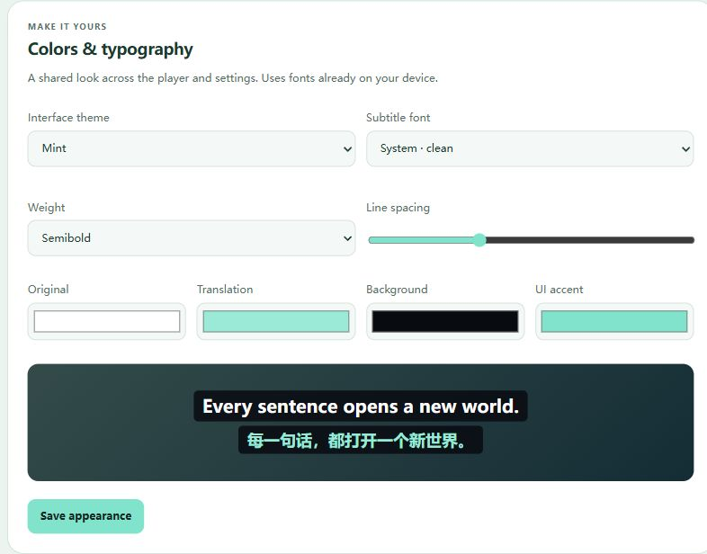

# Sentence

### 让想看的视频，变成看得懂的内容。

**YouTube 双语字幕 · 整句跳转 · AI 语义断句**

看海外课程、听访谈、跟着视频学技能。 
原文与译文同屏，遇到值得细听的一句，按下方向键，再听一遍。

**[开始使用](#开始使用)** · [效果预览](#看懂也听懂) · [常见问题](#常见问题) · [English guide](docs/USER_GUIDE.en.md)

Chrome / Edge 桌面版 · 自选翻译服务 · MIT 开源

 

生产界面实截 · 日中样例字幕；演示使用预设译文，展示排版与交互，不代表实际模型翻译质量。

## 看懂，也听懂

| 对照看懂 | 按句回听 | 连贯地读 |
| :--- | :--- | :--- |
| **原文与译文，一起看。** 学表达、查语意，随时切换双语、仅原文或仅译文。 | **一句没听清，回到那一句。** 用 ← / → 在完整句子间跳转，保持当前播放或暂停状态。 | **让字幕跟上完整的意思。** 可选 AI 语义断句，结合前后文翻译；长句按自然语块呈现。 |

适合想看懂外语教程的人，也适合用真实视频练听力、精读访谈和课程的人。你可以放慢速度细听，也可以提前处理整段视频的字幕。

### 翻译方式，由你选择

已有喜欢的服务，就继续使用它。支持 **DeepL、Google、Microsoft、MyMemory、LibreTranslate**，以及 **DeepSeek、Gemini、OpenRouter、自定义 AI 端点**。

字幕来源与翻译服务独立选择：作者字幕、YouTube 自动字幕都可以使用。视频缺少合适字幕时，还可主动启动**语音字幕生成**（实验性功能）。扩展不附带密钥；服务商按各自规则收费或提供免费额度。

### 调成你喜欢的阅读方式

深色 Midnight 与浅色 Mint，搭配自定义字体、颜色、透明度和双语字号比例。开启鼠标调整后，还可以直接移动、缩放字幕。

  
   外观设置实截 · 本地演示环境，使用样例文本。

## 开始使用

**支持桌面 Chrome 116+，以及具备对应功能的 Edge。** 使用扩展发布包无需安装 Python、Node.js 或本地辅助程序。

1. 从仓库的 **Releases** 下载 `sentence-extension.zip` 并解压。
2. 打开 `chrome://extensions` 或 `edge://extensions`，开启「开发者模式」，点击「加载已解压的扩展程序」，选择含 `manifest.json` 的解压目录。
3. 刷新 YouTube 视频页，点击播放器底部的 **Sentence 字幕图标**，选择字幕来源。
4. 打开 **Providers**，配置翻译服务并点击 **Save, connect & use**；将目标语言设为 **Chinese / zh**，即可双语阅读。

> 初始翻译引擎为关闭状态，目标语言为西班牙语。只看原字幕无需配置翻译服务；需要译文时再连接服务商。

如果仓库尚未发布 Releases，可按[源码安装指南](docs/DEVELOPMENT.zh-CN.md#从源码安装)构建。GitHub 自动生成的 Source code 压缩包是源码，不能直接作为扩展加载。

## 常见问题

<strong>免费吗？需要什么账号？</strong>

扩展按 MIT 许可免费提供。翻译、AI 断句和语音识别使用你配置的服务，可能需要该服务的账号、API 密钥和额度；扩展不提供共享密钥。MyMemory 公共接口可不填密钥，但受其免费额度限制。

<strong>只有原文，没有译文？</strong>

先确认已连接翻译服务、选好目标语言，并开启双语或译文模式。等待翻译期间会暂时显示原文；若处理失败，请检查权限、模型和配额，再点击重试。

如果连原字幕也没有，尝试刷新视频，开启 YouTube 原生 CC 并选择语言，再点击 **Refresh tracks**。更新扩展后，也需要刷新已打开的视频页。

<strong>没有字幕的视频也能用吗？</strong>

可以尝试实验性的语音字幕生成。单独配置语音识别服务后，在工具栏弹窗中选择处理范围并明确启动；也可先用 **Test browser audio · no speech API** 检查音频获取能力，该诊断不调用语音识别服务。

功能取决于视频音轨、当前会话和服务商支持。详见[语音字幕说明](docs/SPEECH.zh-CN.md)。

<strong>字幕和密钥会发到哪里？</strong>

密钥和偏好保存在当前浏览器配置文件中，不通过 Chrome 同步。字幕及必要上下文发送到你选择的翻译 / AI 端点；音频仅在你明确启动语音任务后发送到语音服务。扩展不添加遥测。

开启 AI 语义断句时，即使选择「仅原文」，也可能产生断句请求和费用。停止任务不能撤销服务商已接受的请求。MyMemory 使用 GET，字幕及可选密钥会出现在请求 URL 中。详见[隐私与权限](docs/PRIVACY.zh-CN.md)。

<strong>哪些场景暂不支持？</strong>

当前面向桌面 YouTube 普通视频观看页；Shorts、直播、嵌入播放器、移动端、画中画和无痕会话不在支持范围内。YouTube 接口可能变化；AI 质量取决于模型，字幕时间精度取决于来源。

---

  <a href="docs/USER_GUIDE.en.md">完整使用指南</a> ·
  <a href="docs/SEMANTIC.zh-CN.md">了解语义断句</a> ·
  <a href="CHANGELOG.md">更新日志</a> ·
  <a href="docs/DEVELOPMENT.zh-CN.md">参与开发</a>

<a href="LICENSE">MIT License</a> · <a href="THIRD_PARTY_NOTICES.md">第三方声明</a> 独立开源项目，与 YouTube 及所列服务商无隶属关系。

